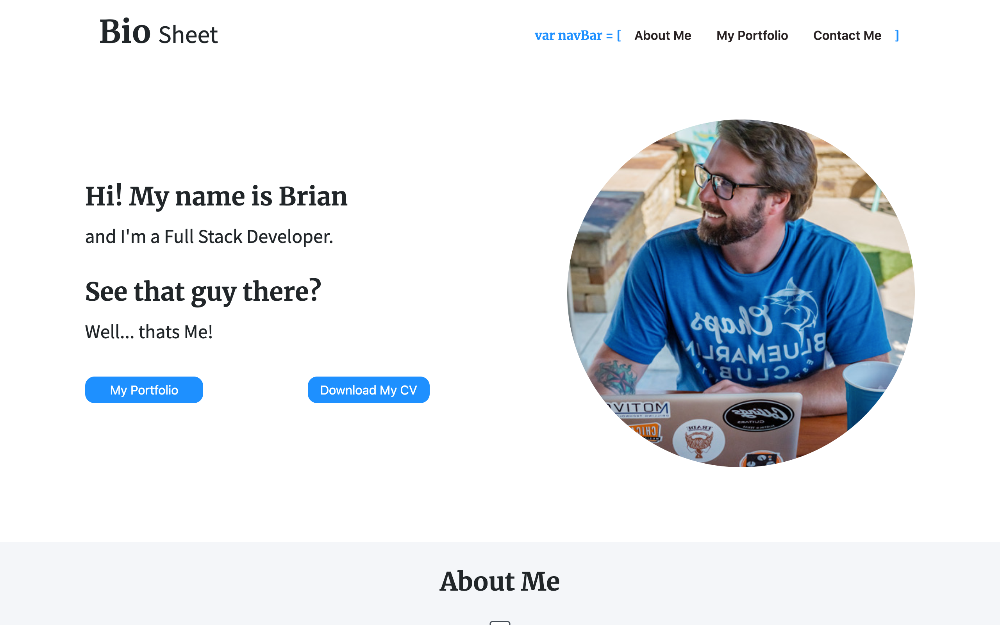

# Personal Portfolio Version 2

This site my personal Bio/Portfolio - It is an ever-changing work in progress as I continue to work towards developing my technical skills.

The page is built with React.js. Currently the site consists of a single page layout with divided into 4 main sections. Above the fold, About Me, Portfolio, and Contact. A navigation bar anchors to the corresponding sections of the page.

## Table of contents

- [Overview](#overview)
  - [The challenge](#the-challenge)
  - [Screenshot](#screenshot)
  - [Links](#links)
- [My process](#my-process)
  - [Built with](#built-with)
  - [What I learned](#what-i-learned)
  - [Continued development](#continued-development)
  - [Useful resources](#useful-resources)
- [Author](#author)
- [Acknowledgments](#acknowledgments)

## Overview

### The challenge

Users should be able to:

- Navigate the site in desktop and mobile views
- Use the navigation menu to move to the corresponding section of the page
- View resume link through google docs
- Toggle through the different portfolio sections and generate portfolio cards for section
- Send a contact form to netlify forms

### Screenshot



### Links

- Git Hub URL: [https://github.com/brianlfarmerllc/dev_portfolio_v2](https://github.com/brianlfarmerllc/dev_portfolio_v2)
- Live Site URL: [https://brianlfarmerllc-biosite.netlify.app/](https://brianlfarmerllc-biosite.netlify.app/)

## My process

### Built with

- Semantic HTML5 markup
- React.js
- JSX Functionality
- React Hook State Management
- Bootstrap 4
- JSON DB

### What I learned

One thing I really wanted to accomplish was to have the ability to manipulate the virtual DOM in a specific section of the page. I was able to accomplish this in the portfolio section by allowing the user to select from a navigation menu what type of project they wanted to view and the content in that section would update.

I created a db.json file where I constructed my project information similar to the format below

```JSON
[
  {
    "fullStack": [
      {
        "image": "burger",
        "imageAlt": "background for eat-da-burger",
        "site": "https://eat-da-burger-brianlfarmerllc.herokuapp.com/",
        "name": "Eat-Da-Burger Application",
        "icon": "https://img.icons8.com/material-outlined/48/000000/hamburger.png",
        "iconAlt": "burger icon",
        "type": "Full Stack App",
        "github": "https://github.com/brianlfarmerllc/Handelbars_Eat_Da_Burger"
      },
      {
        "image": "notebook",
        "imageAlt": "background for notetaker",
        "site": "https://note-taker-brianlfarmerllc.herokuapp.com/",
        "name": "Note Taker Application",
        "icon": "https://img.icons8.com/wired/64/000000/pencil.png",
        "iconAlt": "pencil icon",
        "type": "Full Stack App",
        "github": "https://github.com/brianlfarmerllc/Note_Taker"
      }
    ]
  }
]
```

Then I used an event handler to compare the name associated with the selected anchor tag and set the portfolio state to match. This one switch statement handles both the virtual dom manipulation and the changing of the color on the active anchor tag.

```JSX
const [portfolioState, setPortfolioState] = useState(portfoliocopy[3].reactApps)
const [currentItemState, setCurrentItemState] = useState("React Apps");

    const handleClick = event => {
        event.preventDefault()
        const name = event.target.name
        switch (name) {
            case "React Apps":
                setPortfolioState(portfoliocopy[3].reactApps)
                setCurrentItemState("React Apps")
                break;
            case "Full Stack":
                setPortfolioState(portfoliocopy[0].fullStack)
                setCurrentItemState("Full Stack")
                break;
            case "Browser Apps":
                setPortfolioState(portfoliocopy[1].browserApps)
                setCurrentItemState("Browser Apps")
                break;
            case "CLI Apps":
                setPortfolioState(portfoliocopy[2].cliApps)
                setCurrentItemState("CLI Apps")
                break;

            default:
                return
        }
    }
```

This one switch statement handles both the virtual dom manipulation and the changing of the color on the active anchor tag using a ternary operator on the anchors style attribute

```jsx
<a
  className="list-item"
  href="#"
  name="React Apps"
  style={{
    color: currentItemState === "React Apps" ? "dodgerblue" : "black",
  }}
  onClick={handleClick}
>
  React Apps
</a>
```

### Continued development

This was a challenging project for me at the time with my current skill set using react, managing state, and using state as the single source of truth. I plan on using React in many more projects to progress with my understanding of all the available hooks.

### Useful resources

- [React Documentation](https://reactjs.org/docs/getting-started.html) - I learn a lot about React by just using their documentation. Well thought ought and put together information

## Author

- Website - [Brian Farmer](https://brianlfarmerllc-biosite.netlify.app/)
- GitHub URL: - [GitHub URL](https://github.com/brianlfarmerllc/fem_launch_timer)
- Frontend Mentor - [@brianlfarmerllc](https://www.frontendmentor.io/profile/brianlfarmerllc)
